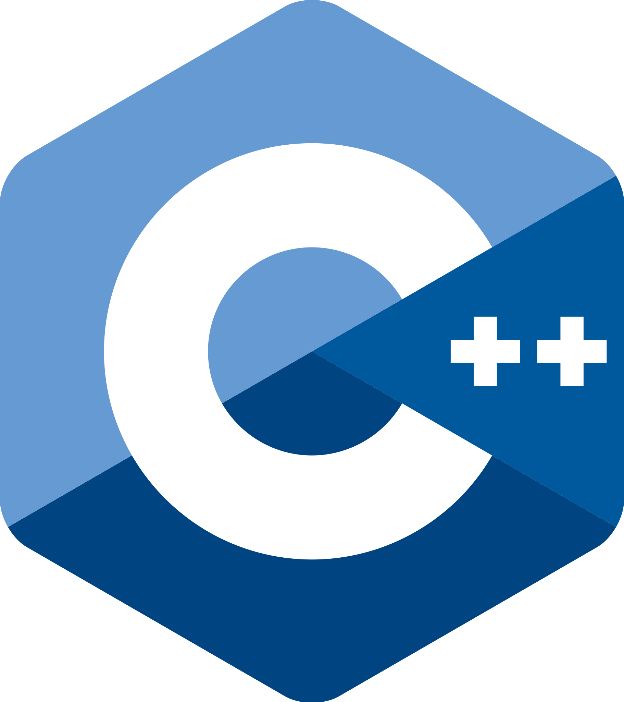
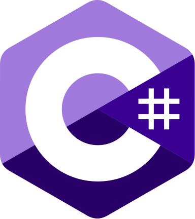
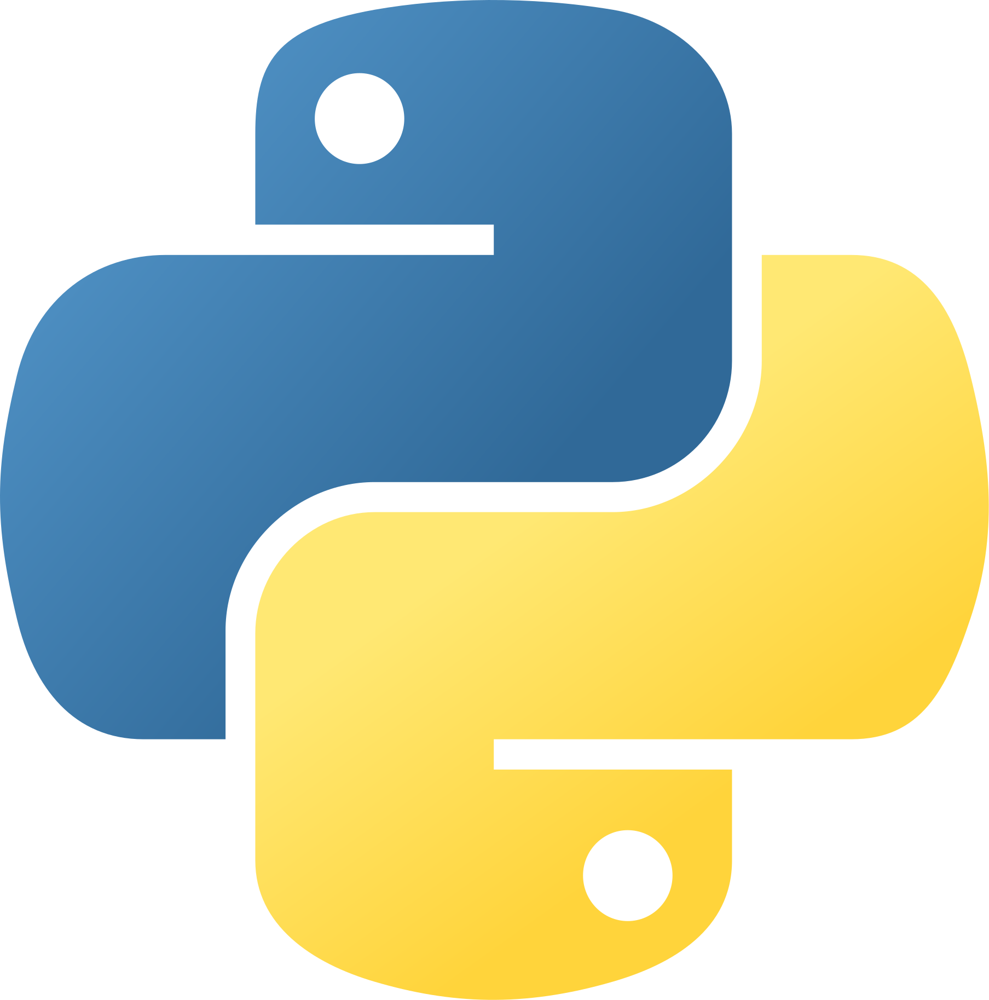
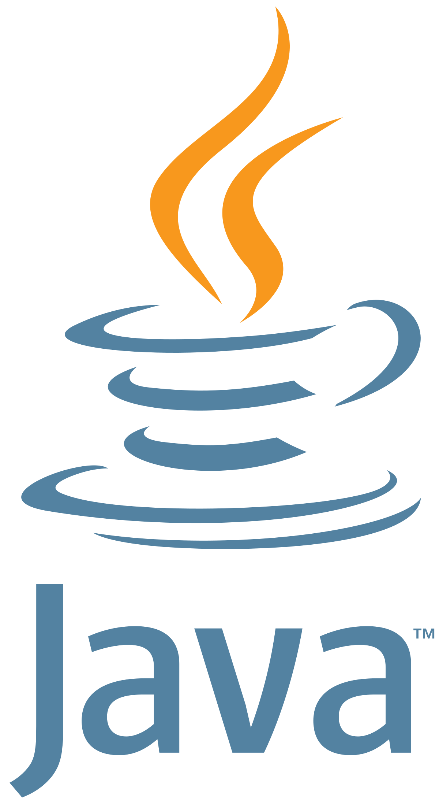
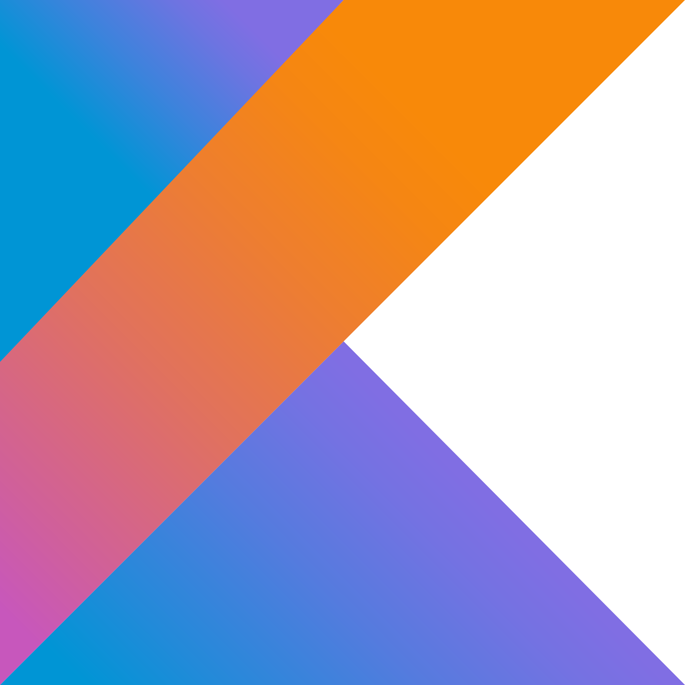
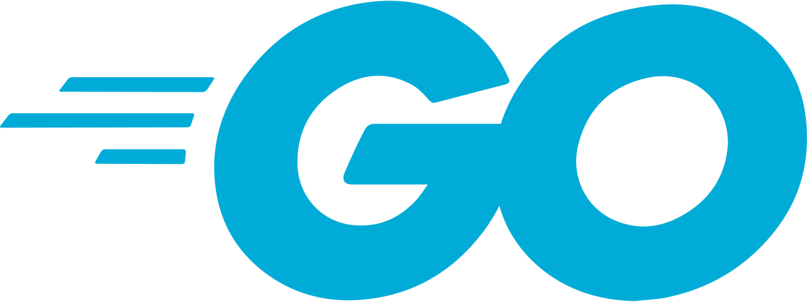

# Introduction
## About Me

Hi there! 👋 My name is Buratud and I am passionate about programming.

## Education

- Vocational Certificate, Electrical, KMUTNB, 2021

## Programming Languages

    
    
    
    
    
    
    
    
    
    

